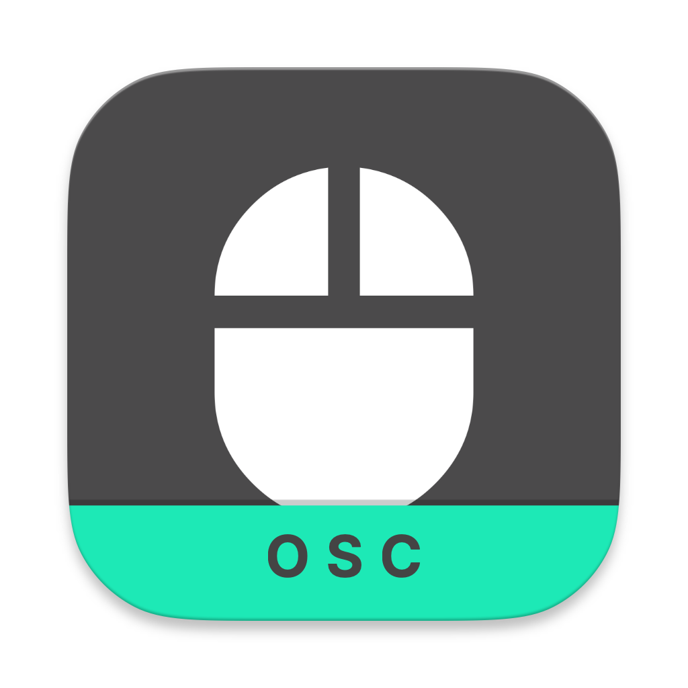

# Logitech x ECAL Workshop

## About the Workshop

This repository contains tools and examples developed for the **Workshop Logitech x ECAL** at ECAL in November 2025. The workshop is a collaborative effort between Logitech and ECAL's Media & Interaction Design BA and Industrial Design BA students.

Titled **"Beyond the Desk – Students take control"** the workshop will explore alternative use and experience of logitech devices. Trough hacking the devices and using them in new ways, the students will explore new possibilities for interaction and experience.

## Overview of this repository

A collection of tools for capturing and dispatching HID (Human Interface Device) events via OSC (Open Sound Control) protocol.

## Components

### Mouse Event Dispatcher

A macOS application that captures mouse events and sends them via OSC.

- Located in: `software/Mouse-Event-Dispatcher-UI/`
- Features:
  - Captures mouse movement, clicks, and scroll events
  - Sends events via OSC with configurable host/port
  - Rate limiting for mouse movement events
  - Accessibility permissions handling

### Keyboard Event Dispatcher

A macOS application that captures keyboard events and sends them via OSC.

- Located in: `software/Keyboard-Event-Dispatcher-UI/`
- Features:
  - Captures key down, key up, and modifier key events
  - Configurable event filtering (key down, key up, modifiers)
  - Sends events via OSC with configurable host/port
  - Accessibility permissions handling

### Node HID Server

A Node.js server that receives OSC messages and forwards them via WebSockets.

- Located in: `software/Node-HID-Server/`
- Features:
  - Listens for OSC messages on configurable port
  - Forwards messages to connected WebSocket clients
  - Web interface for configuration and monitoring
  - Message filtering and logging capabilities

## Examples

The repository includes several examples to help you get started with using the HID Event Dispatchers:

### Arduino Examples

Located in `Examples/Arduino/`, these examples demonstrate how to receive OSC messages on an ESP32 microcontroller:

- **LED-Strip-example**: Controls an LED strip based on mouse movements and clicks
- **OSC-WIFI-RECEIVER**: Basic example for receiving OSC messages over WiFi

These examples show how to:

- Connect to WiFi and receive OSC messages
- Process different types of HID events (mouse movements, clicks, scrolls)
- Trigger physical outputs based on these events

### Web Examples

Located in `Examples/Web/`, these examples demonstrate how to use the OSC data in web applications via WebSockets:

- **MIDI-Controller**: Web-based MIDI controller interface
- **Mouse-Distance-Tracker**: Tracks and visualizes mouse movement distances
- **Mouse-Sound-Generator**: Generates sounds based on mouse movements
- **Websocket-client-example**: Basic example of connecting to the Node HID Server

## OSC Message Reference

The applications use the following OSC message formats for communication:

### HID Event Messages (Mouse/Keyboard → OSC)

| Address Pattern | Description | Parameters |
|----------------|-------------|------------|
| `/hid/move` | Mouse movement | `deviceID` (int), `x` (int), `y` (int), `deltaX` (float), `deltaY` (float) |
| `/hid/left_down` | Left mouse button down | `deviceID` (int), `x` (int), `y` (int), `pressure` (float), `clickCount` (int) |
| `/hid/left_up` | Left mouse button up | `deviceID` (int), `x` (int), `y` (int), `pressure` (float), `clickCount` (int) |
| `/hid/right_down` | Right mouse button down | `deviceID` (int), `x` (int), `y` (int), `pressure` (float), `clickCount` (int) |
| `/hid/right_up` | Right mouse button up | `deviceID` (int), `x` (int), `y` (int), `pressure` (float), `clickCount` (int) |
| `/hid/middle_down` | Middle mouse button down | `deviceID` (int), `x` (int), `y` (int), `pressure` (float), `clickCount` (int) |
| `/hid/middle_up` | Middle mouse button up | `deviceID` (int), `x` (int), `y` (int), `pressure` (float), `clickCount` (int) |
| `/hid/scroll` | Mouse scroll wheel | `deviceID` (int), `x` (int), `y` (int), `deltaX` (float), `deltaY` (float), `deltaZ` (float) |
| `/hid/key_down` | Keyboard key down | `deviceID` (int), `keyCode` (int), `characters` (string), `modifiers` (int) |
| `/hid/key_up` | Keyboard key up | `deviceID` (int), `keyCode` (int), `characters` (string), `modifiers` (int) |
| `/hid/flags_changed` | Modifier keys changed | `deviceID` (int), `modifiers` (int) |

## Download

You can download the latest release from the [GitHub Releases page](https://github.com/ecal-mid/Logitech-ECAL/releases/latest).

### Latest Release

- **Mouse Event Dispatcher**: [Download ZIP](https://github.com/ecal-mid/Logitech-ECAL/releases/latest/download/MouseOSCDispatcher-v1.0.0.zip)
- **Keyboard Event Dispatcher**: [Download ZIP](https://github.com/ecal-mid/Logitech-ECAL/releases/latest/download/KeyboardOSCDispatcher-v1.0.0.zip)

## Requirements

- macOS 10.15 or later
- Xcode Command Line Tools (for building Swift applications)
- Node.js 14+ (for Node HID Server)

## Helper Tools

### Protokol

For testing and debugging OSC and MIDI messages, we recommend using Protokol.

- **Description**: Protokol is a free, cross-platform application for monitoring, testing, and debugging OSC and MIDI messages.
- **Features**:
  - Real-time monitoring of incoming OSC messages
  - Visualization of message parameters
  - Message history and filtering
  - Send custom OSC messages for testing
  - MIDI monitoring and testing
  - Configurable ports and settings
- **Download**: [Protokol Website](https://hexler.net/protokol)
- **Usage with this project**:

1. Open Protokol
2. Set the input port to match your OSC sender (default: 8000)
3. Start the Mouse or Keyboard Event Dispatcher
4. Observe the incoming OSC messages in real-time

## Credits

ECAL / Media & Interaction Design / Alain Bellet
