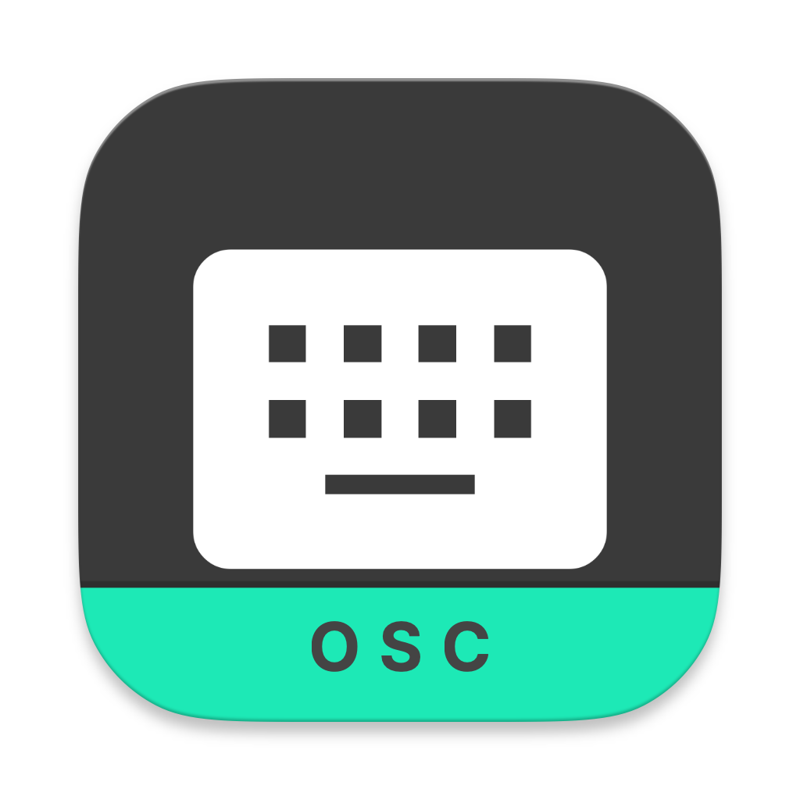
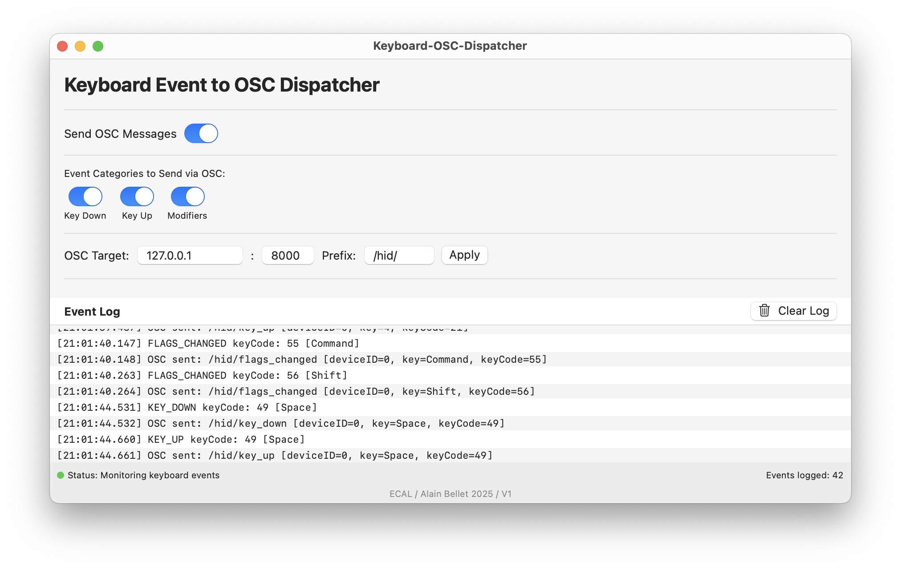

# Keyboard Event Dispatcher



A macOS application that captures keyboard events, can block them from specific devices, and sends them via OSC protocol.



## Features

- Captures all keyboard events (key down, key up, modifier keys)
- Blocks events from specific keyboard devices
- Sends events via OSC protocol
- Configurable OSC address prefix
- Filter which event types to send via OSC
- Detailed event logging
- Menu bar integration

## Installation

1. Download the latest release ZIP file from the releases page [Download ZIP](https://github.com/ecal-mid/Logitech-ECAL/releases/latest/download/KeyboardOSCDispatcher-v1.0.0.zip)
2. Extract the ZIP file to get the KeyboardOSCDispatcher folder
3. **RECOMMENDED METHOD:** Use the installer script
   - Open Terminal (Applications > Utilities > Terminal)
   - Drag and drop the `install.sh` file into the Terminal window
   - Press Enter to run the script
   - Enter your password if prompted
4. Grant accessibility permissions when prompted after launching the app

**Note:** Due to macOS security features (Gatekeeper), using the installer script is the most reliable way to install the application. See the IMPORTANT_READ_ME.txt file included with the download for more details.

## Usage

### Basic Operation

1. The app will appear in your menu bar with a keyboard icon
2. Click the icon to show/hide the main window
3. The app will automatically request accessibility permissions if needed

### Blocking Events

- Toggle "Block Events Propagation of external keyboard (deviceID 0)" to block events from the specified device
- Currently, the app is configured to block deviceID 0, which is typically an external keyboard
- When blocking is enabled, the background will turn yellow

### OSC Configuration

- Toggle "Send OSC Messages" to enable/disable OSC output
- Toggle "Send OSC Messages from blocked device only" to control which events are sent
- Configure the OSC target host, port, and address prefix
- Click "Apply" to save the settings
- Use the event category toggles to filter which types of events are sent via OSC

## OSC Message Format

The app sends OSC messages with the following format:

```text
/[prefix]/[event_type] [deviceID] [event-specific values]
```

### Event Types and Values

1. Key Down Events (`/keyboard/key_down`):
   - deviceID (int)
   - keyCode (int)
   - characters (string)
   - charactersIgnoringModifiers (string)
   - modifierFlags (int)

2. Key Up Events (`/keyboard/key_up`):
   - deviceID (int)
   - keyCode (int)
   - characters (string)
   - charactersIgnoringModifiers (string)
   - modifierFlags (int)

3. Modifier Key Events (`/keyboard/flags_changed`):
   - deviceID (int)
   - keyCode (int)
   - modifierFlags (int)

## Requirements

- macOS 10.15 or later
- Accessibility permissions

## License

© 2025 ECAL / Alain Bellet. All rights reserved.
