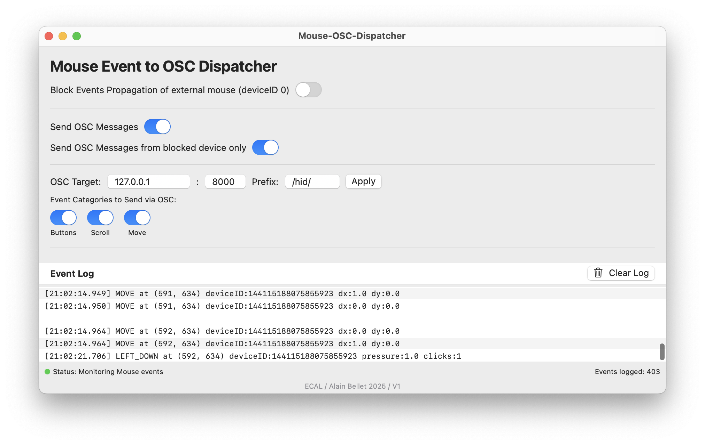

# HID Event Dispatcher UI


A macOS application with a graphical user interface that captures HID (Human Interface Device) events, logs them with detailed information, and can optionally block them from reaching other applications. It also supports sending events via OSC (Open Sound Control) to other applications.



## Features

- **Modern SwiftUI Interface**: Clean and intuitive user interface
- **Event Logging**: Captures and displays all mouse events with detailed information
- **Selective Blocking**: Block events from specific device IDs (deviceID 0)
- **Menu Bar Integration**: Access the app quickly from the menu bar
- **Log Management**: View, scroll, and clear the event log
- **OSC Integration**: Send blocked events via OSC to other applications
- **Flexible OSC Settings**: Configure host, port, and control which events are sent

## Installation

1. Download the latest release ZIP file from the releases page [Download ZIP](https://github.com/ecal-mid/Logitech-ECAL/releases/latest/download/MouseOSCDispatcher-v1.0.0.zip)
2. Extract the ZIP file to get the MouseOSCDispatcher folder
3. **RECOMMENDED METHOD:** Use the installer script
   - Open Terminal (Applications > Utilities > Terminal)
   - Drag and drop the `install.sh` file into the Terminal window
   - Press Enter to run the script
   - Enter your password if prompted
4. Grant accessibility permissions when prompted after launching the app

**Note:** Due to macOS security features (Gatekeeper), using the installer script is the most reliable way to install the application. See the IMPORTANT_READ_ME.txt file included with the download for more details.

## Building and Running

The application is built using a single Swift file and a simple Makefile:

```bash
# Build the application
make

# Build and run the application
make run

# Clean build artifacts
make clean
```

## Usage

1. **Grant Accessibility Permissions**: When first launched, the app will request accessibility permissions. These are required to monitor and block HID events.

2. **Toggle Blocking**: Use the switch in the app window or the menu bar item to toggle event blocking on and off.

3. **View Logs**: The main window displays a scrollable log of all HID events with timestamps and detailed information.

4. **Clear Logs**: Click the "Clear Log" button to clear the event log.

5. **OSC Integration**:
   - Enable OSC by toggling "Send OSC Messages for Blocked Events"
   - Choose whether to send all mouse move and scroll events or only blocked ones
   - Set the target host (default: localhost) and port (default: 8000)
   - Click "Apply" to update the OSC settings

## Event Information

Each logged event includes:

- Event type (LEFT_DOWN, RIGHT_UP, SCROLL, etc.)
- Screen coordinates
- Device ID
- Event-specific values (pressure, delta values, click count)
- [BLOCKED] tag for events that were blocked

## Technical Details

- Single-file SwiftUI application
- Uses CGEvent tap for reliable event monitoring and blocking
- Supports menu bar integration and window management
- Implements MVVM pattern for clean separation of concerns
- Network framework for UDP/OSC communication

## OSC Message Format

The application sends OSC messages with the following format:

- **Address Pattern**: `/hid/[event_type]` (e.g., `/hid/left_down`, `/hid/move`, `/hid/scroll`)
- **Arguments**:
  1. X coordinate (integer)
  2. Y coordinate (integer)
  3. Device ID (integer)
  4. Event-specific values:
     - For scroll events: deltaX, deltaY, deltaZ (floats)
     - For mouse movement: deltaX, deltaY (floats)
     - For clicks: pressure, clickCount (float, integer)

## Requirements

- macOS 11.0 or later
- Accessibility permissions
